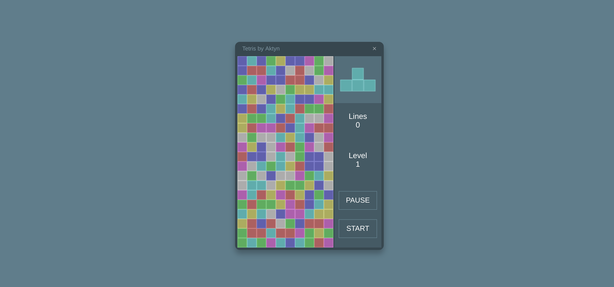

# Tetris-widget
Simple tetris game. 
Easy to run. 
Just include tetris.js file anywhere in browser page.

Entire code is packed into Immediately-invoked function expression (IIFE) so it will execute as soon as script loads. If you wish to control when to start widget, convert IIFE into regular named function and invoke it later in your web application.

